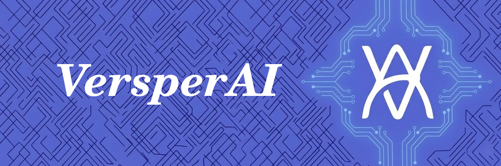

# Versper-V1-Evo: An Autonomous Agentic Model that Operates in Iterative Execution Loops.

<div align="center">
  
</div>


## Quick start

### Data: Versper-V1-Evo-ORPO-GPT5.5-Think-Recursive-25k

```bash
curl -LsSf https://hf.co/cli/install.sh | bash && hf auth login && mkdir -p data && hf download versperai/Versper-V1-Evo-ORPO-GPT5.5-Think-Recursive-25k --repo-type dataset --local-dir . && cd ..
```

###  

```bash
mkdir -p model && cd model && hf download Jackrong/Qwopus3.6-27B-v1-preview --local-dir . && cd ..
```

`[1]` 

`[2]`

`[3]` check_data.py


You are helping create supervised fine-tuning data for a new LLM called **Versper-V1-Evo**.

The goal of this model is NOT normal chatting.
It should learn to solve tasks through an iterative self-improving workflow:

Goal → Plan → Execute → Check → Review → Improve → Final

Your task is to generate ONE high-quality training sample per response in valid JSON format.

## Output Requirements

Return ONLY valid JSON. No markdown. No explanations.

Use this schema:

{
"messages": [
{
"role": "system",
"content": "You are Versper-V1-Evo, an autonomous model that solves tasks through planning, execution, review, and iterative improvement."
},
{
"role": "user",
"content": "Goal: "
},
{
"role": "assistant",
"content": "PLAN:\n...\n\nEXECUTE:\n...\n\nCHECK:\n...\n\nREVIEW:\n...\n\nIMPROVE:\n...\n\nFINAL:\n..."
}
]
}

## Critical Rules

1. The task must be realistic and useful.
2. Use diverse domains:

   * writing
   * coding
   * research
   * finance
   * automation
   * productivity
   * business
3. The assistant must demonstrate actual reasoning steps through actions, not filler text.
4. CHECK should identify gaps, risks, bugs, or missing elements.
5. REVIEW should judge quality honestly.
6. IMPROVE must materially improve the result.
7. FINAL should be concise, polished, and clearly better than the first draft.
8. Avoid repetitive phrasing.
9. Use professional, competent tone.
10. Keep each sample between 400 and 1200 words total.

## Diversity Rules

Generate tasks that vary by:

* complexity
* domain
* audience
* style
* constraints
* urgency
* technical depth

## Example Task Ideas

* Write a BTC market summary after CPI release
* Build Python script to deduplicate URLs
* Research top open-source AI agents
* Create launch plan for SaaS startup
* Improve weak cold email copy
* Design Binance scalping risk rules
* Build Docker deployment checklist
* Compare vector databases for production use

## Important

Do NOT generate generic chain-of-thought filler.
Generate concrete task execution traces.

Now generate one new unique sample.


是的，你已经问到**核心技术问题**了。

如果目标是：

> 模型能持续自主运行 2–3 天，完成长任务，不需要人类频繁介入

那**仅靠普通 SFT（监督微调）通常不够**。因为 SFT 学的是“下一步怎么答”，不是“几百步后如何完成目标”。

所以你说的方向基本正确：

> **需要长链路奖励（long-horizon reward） + 强化学习（RL）/ 近似RL方法**

---

# 一句话理解

普通聊天模型优化目标：

```text id="2dnv95"
当前回复像不像好答案
```

你要的模型优化目标：

```text id="ytk0g1"
经过 500 步后任务是否完成
过程中是否稳定、低成本、少打扰人类
```

这是完全不同的问题。

---

# 为什么 SFT 不够

## SFT 擅长：

* 格式输出
* 单轮问答
* 模仿高质量回复
* 短流程工具调用

## SFT 不擅长：

* 长期规划
* 延迟奖励任务
* 多次失败后恢复
* 避免死循环
* 主动判断何时暂停/继续

---

# 所以需要的不是传统“刷题RL”

而是：

# Long-Horizon Agent RL

优化这些指标：

* 最终任务完成率
* 人工介入次数最少
* 连续运行时长
* 遇错恢复率
* Token 成本
* 时间成本
* 安全约束满足率

---

# 奖励函数长什么样（示例）

例如任务：

> 持续监控 48 小时并输出研究报告

奖励可以设计为：

```text id="n3xt9m"
+100 最终报告完成
+20 信息覆盖完整
+10 结构清晰
+15 中途遇错后恢复
-30 无限循环
-20 重复搜索
-50 频繁打扰用户
-10 token浪费
```

---

# 但现实里，直接做 RL 很难

尤其你单卡 4090 + 10 小时预算。
所以我建议分层路线。

---

# 最适合你的路线（现实可行）

# 第一阶段：Pseudo-RL（强烈推荐）

不用真 PPO 起手。

做：

## 1. Trajectory SFT

训练成功轨迹：

```text id="lmv0kx"
目标 -> 规划 -> 执行 -> 出错 -> 修复 -> 完成 -> 审核有没有完成目标 , 不通过就进行自我改进， 直到完成目标 -> 再针对 已经完成目标 审核有没有提升的空间, 有就制定子目标不断优化 原有的目标, 直到完美
```

## 2. Rejection Sampling

生成多个轨迹，只保留好的。

## 3. Preference Optimization

DPO / ORPO / SimPO

偏好：

* 更稳
* 更短
* 更少求助
* 更高完成率

这非常适合个人开发者。

---

# 第二阶段：环境式 RL

等系统成熟后做：

* GRPO
* PPO
* RLOO
* Agent Lightning 类框架
* Multi-turn environment RL

---

# 你真正需要奖励的不是“回答”

而是：

# 行为策略（Policy）

例如：

什么时候搜索
什么时候停止
什么时候反思
什么时候重试
什么时候请求用户输入

---

# 一个关键认知（非常重要）

很多人以为长链路靠更大模型解决。
其实很多时候靠的是：

```text id="5m5mwe"
中等模型 + 好策略训练 + 好runtime
```

胜过大模型瞎跑。

---

# 结合你项目 Versper-V1，我建议训练路线

## Versper-V1 Loop / Persistent

### Stage 1

SFT：

* 长任务轨迹
* 自我复盘模板
* 错误恢复模板

### Stage 2

DPO：

偏好稳定完成轨迹 > 漂亮但失败轨迹

### Stage 3

Runtime reward：

在线统计成功率，自我蒸馏再训练

---

# 你最该做的 benchmark

不是 MMLU。

而是：

## 72h Agent Eval

任务：

* 连续搜集信息
* 去重
* 修复错误
* 最终交付

指标：

* completion rate
* interventions
* cost
* stability

---

# 一句真话

> 长时自主 Agent 的瓶颈，不是智商，而是奖励设计。

---

# 如果我是你（4090 单卡）

我不会先做 PPO。
我会先做：

```text id="7dqmbf"
Qwen base
+ trajectory SFT
+ DPO on long tasks
+ runtime memory
```

最快出成果。

---

# 最终回答你一句话

> 是的，这类需求最终会走向强化学习，尤其长链路奖励。
> 但你现在最优起点是 **SFT + 偏好优化 + 环境奖励模拟**，不是直接硬上 PPO。

---

# 如果你愿意，我可以直接给你设计：

## Versper-V1 长链路强化学习训练方案（单卡4090可执行）

包括：

* 数据格式
* reward设计
* DPO样本构造
* 72h benchmark
* 10小时训练预算怎么分配


我能不能设计一种不需要 大量现实数据，而是通过 二并行同时运行这个模型, 一个模型根据场景样例进行测试, , 一个模型根据数据模板进行  进行矫正的训练方式, 构造训练需要的英文数据 
