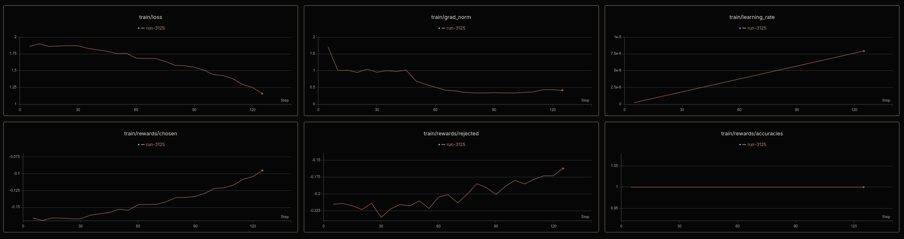
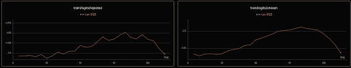
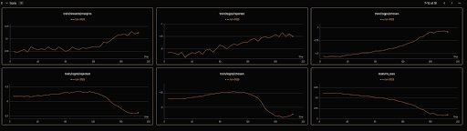
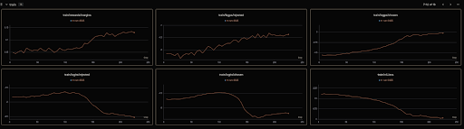
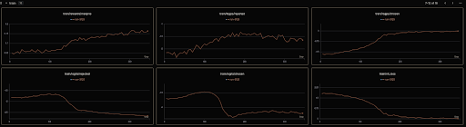
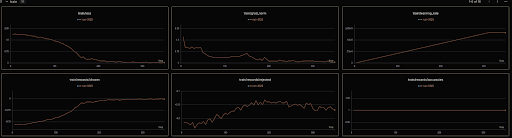

# Versper-V1-Evo: An Autonomous Agentic Model that Operates in Iterative Execution Loops.

<div align="center">
  
</div>

## 1. Quick start

### Init Train Environment

```bash
uv venv && uv sync && source .venv/bin/activate
```

### Fetch Data: Versper-V1-Evo-ORPO-GPT5.5-Think-Recursive-25k

> Q1: Why use recursisve code & scientific think long data, not just ordinary chat short data?  
> A1: just code & scientific have longest tokens, biggest value density, closest relational connection, and have deterministic preference for right-wrong rewards.

> Q2: How to set data shema to let model evolution to what we need feature  
> A2: i want model can self-evolution in iterative loop can task-oriented learning so use ORPO + Process Reward Modeling and use prompt + chosen + rejected as data schema 

```bash
curl -LsSf https://hf.co/cli/install.sh | bash && hf auth login && mkdir -p data && hf download versperai/Versper-V1-Evo-ORPO-GPT5.5-Think-Recursive-25k --repo-type dataset --local-dir . && cd ..
```

### Pull Model: Versper-V1-Instruct  

```bash
mkdir -p model && cd model && hf download versperai/Versper-V1-Instruct --local-dir . && cd ..
```

## 2. EDA - data/eda.py

### Choose max_seq_length can cover all data sequence lengths and %64

```python
# analysis data distribution and data features
# used in train make sure no data overflow

max_seq_length = 4480 #  max_prompt_length=1280 + max_completion_length=3264 
overflow = 0

for p, c, r in zip(prompt_lens, chosen_lens, rejected_lens):
    # ORPO：prompt + chosen / rejected
    if p + c > max_seq_length or p + r > max_seq_length:
        overflow += 1
```

### Random Sample to make sure the data is complete and correct loaded 

```python
for _ in range(2):
    ex = random.choice(data)

    print("PROMPT:\n", ex["prompt"][:300])
    print("\nCHOSEN:\n", ex["chosen"][:300])
    print("\nREJECTED:\n", ex["rejected"][:300])
    print("=" * 80)
```

## 3. Eval - eval/inference.py

```python
# Construct Conversation
messages = [{"role": "user", "content": "你好."}]

prompt = tokenizer.apply_chat_template(
    messages, tokenize=False, add_generation_prompt=True
)
```

## 4. Train - trainer/train_orpo.py

> Watch the orpo-evo post-trian logs in [Training  Metric Logging](https://swanlab.cn/@HaibaraYuki/Versper-V1-ORPO/runs)  
> scientific exploration : pre-train : post-train = 3 : 1 : 1  
> batch_size	4, grad_accum 3 => total batch 12 trained in two 4090 48G VAGM

### 4.1 Steps - 125

<div align="center">
  
</div>

> **Core Loss:** Steady decline in <code>nll_loss</code> and stable <code>grad_norm</code> (<0.5) indicate robust language modeling and stable gradients.  
> **ORPO Metrics:** <code>margins</code> and <code>log_odds_ratio</code> are rising, proving the model is effectively widening the gap between <code>chosen</code> and <code>rejected</code> responses.  
> **Reward Accuracy:** Sustained at 1.0, showing strong discriminative power on the Vesper-V1 dataset.  
> **Log Probabilities:** Asymmetric growth (chosen > rejected) confirms the model prioritizes high-quality outputs over mere imitation.  
> **Conclusion:** Training is optimal. Convergence is expected around step 1500.  

### 4.2 Explain the two curves show an upward trend followed by a downward trend

<div align="center">
  
</div>

> The logits of chosen and rejected all rise - Training startup in Warmup the learnning rate line raise, model learn date distribution fastly.  
> Logits of the chosen are consistently higher than those of the rejected - orpo make model preference to chosen.

### 4.3 Steps - 200

<div align="center">
  
</div>

> train/rewards/margins consistently rise - preference chosen  
> NLL Loss consistently down - the sft incurs no loss in language modeling preference

### 4.4 After all down, just chosen raise

<div align="center">
  
</div>

> Optimizer Dynamics, after warmup, adamw start update weight, enhance training stability, the model tends to compress the output magnitude of the final Linear Head.  
> The "Annealing" Effect of Probability Distribution: In ORPO, the model must simultaneously minimize NLL Loss (SFT loss) and ORPO loss. When competition between these two objectives occurs, the model finds that reducing the absolute values of overall Logits allows it to more effectively utilize the non-linear region of the Softmax function, thereby amplifying the relative probability ratio between chosen and rejected responses.  

### 4.5 Why chosen logits little down when train/logps/chosen close to zero 

<div align="center">
  
</div>

<div align="center">
  
</div>

> In ORPO, the absolute value of an individual Logit is secondary; the primary focus is the Log Odds Ratio between them.  
> Rising Margin: The first chart shows train/rewards/margins reaching a new peak after Step 300, breaking past the 0.16 threshold.  
> Logps/Chosen Saturation: The third chart shows train/logps/chosen approaching zero (where a log probability of 0 implies a 100% probability). Once the probability saturates, further increasing absolute Logit values yields no practical gain, causing the curve to plateau or drift downward.  
> Extremely Low NLL Loss: In the bottom-right chart, train/nll_loss has nearly bottomed out. This indicates the model has reached high certainty, predicting the "chosen" response almost instinctively.


### 4.6 Why train/loss and train/rewards/chosen first up then down

<div align="center">
  
</div>

> **Convergence Path:** Loss and Chosen Rewards shift from curved (rapid adaptation) to linear (probability saturation), signaling the model has mastered the "chosen" responses.  
> **Adversarial Logic:** The "Rejected" curve fluctuates sharply as the model aggressively penalizes diverse errors, widening the margin between good and bad responses.  
> **Gradient Spikes:** Occasional `grad_norm` peaks indicate the model encountering and "correcting" difficult edge cases or high-penalty samples during the optimization process.

### 4.7 Why Smaller Logits Prevent Overfitting

> **Mathematical Regularization:** Smaller logits "soften" the Softmax distribution, preventing the model from becoming "overconfident" (approaching 100% probability) and forced to maintain a margin of uncertainty that improves generalization.
> **Weight Constraint:** Since logits are a product of weights and activations, smaller logits implicitly limit the **Weight Norm**, preventing the model from reacting explosively to minor input variations—a classic sign of overfitting.
> **ORPO Optimization:** In your **Vesper-V1** training, sinking logits indicate the model is moving away from rote memorization toward a "humbler," more stable state where it prioritizes the **Margin** (relative difference) over absolute output magnitude.

## 5. ORPO content


### **ORPO Paper Breakdown**
**Core Concept:** Merges SFT and preference alignment into a single step, eliminating the need for a reference model or a pre-training SFT warmup phase.
***
#### **1. Issues with Existing Methods**
| Method | RLHF (PPO) | DPO | ORPO |
| :--- | :--- | :--- | :--- |
| **Constraint** | Computationally expensive; requires multiple models. | Requires a reference model; lacks an integrated SFT objective. | Single-stage; reference-free; memory-efficient. |

**Key Finding:** The Cross-Entropy loss in SFT only rewards "chosen" responses but fails to penalize "rejected" ones, causing the model to learn both styles simultaneously.
***
#### **2. ORPO Loss Function**
$$\mathcal{L}_{ORPO} = \mathcal{L}_{SFT} + \lambda \cdot \mathcal{L}_{OR}$$
*   **$\mathcal{L}_{SFT}$**: Standard NLL loss, ensuring the model learns to generate "chosen" responses.
*   **$\mathcal{L}_{OR} = -\log\sigma\left(\log\frac{\text{odds}(y_w|x)}{\text{odds}(y_l|x)}\right)$**: The Odds Ratio loss.

**What is the Odds Ratio?**
$$\text{odds}_\theta(y|x) = \frac{P_\theta(y|x)}{1 - P_\theta(y|x)}$$
This represents the ratio of the probability of generating $y$ versus not generating $y$.

**The Role of $\mathcal{L}_{OR}$:**
*   Increases the odds of "chosen" responses (making the model more likely to generate them).
*   Decreases the odds of "rejected" responses (making the model less likely to generate them).
***
#### **3. Why Use Odds Ratio Instead of Probability Ratio?**
*   **Probability Ratio**: $\frac{P(y_w|x)}{P(y_l|x)}$, focuses solely on raw probabilities.
*   **Odds Ratio**: Accounts for the denominator $(1 - P(y|x))$, which amplifies gradients when probabilities are low, accelerating the learning process.

The paper proves that the **OR gradient** consists of two parts:
1.  A term that penalizes incorrect predictions.
2.  A contrastive term between the "chosen" and "rejected" responses.

When the model favors a "rejected" response, $\delta(d)$ accelerates parameter updates to correct the error faster.
***
#### **4. Paper Concepts vs. Your Training Metrics**
| SwanLab Metric | Corresponding Paper Concept |
| :--- | :--- |
| `train/logps/chosen` | Log probability of the preferred response. |
| `train/logps/rejected` | Log probability of the dispreferred response. |
| `train/log_odds_ratio` | The $\log$ of the ratio between chosen and rejected odds. |
| `train/log_odds_chosen` | Individual log odds for the chosen response. |
***
#### **5. Meaning of $\beta$ (Your Configuration: $\beta=0.1$)**
In the TRL implementation of ORPO, the loss function is defined as:
$$\mathcal{L} = \mathcal{L}_{\mathrm{SFT}} - \beta \cdot \log\sigma(\mathrm{log\_odds\_ratio})$$
*   **Higher $\beta$**: Stronger preference signal; the model more aggressively distinguishes between superior and inferior responses.
*   **Lower $\beta$**: Insufficient preference learning.
*   **Recommended Range**: The paper suggests $\beta \in [0.05, 0.2]$; your setting of **0.1** is within the optimal range.
